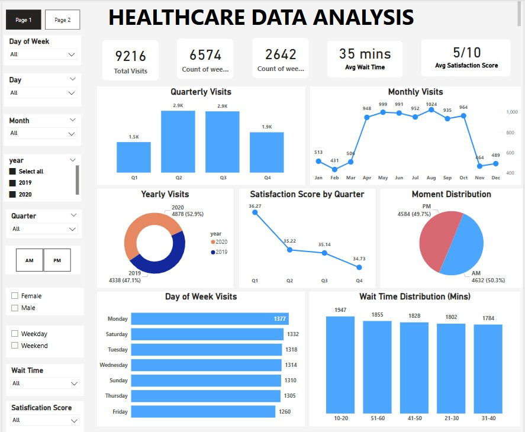
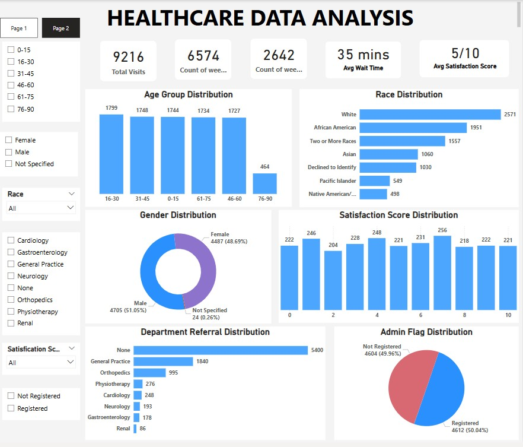

# 🩺 CareScope – Healthcare Data Insights Dashboard

**CareScope** is an interactive data visualization dashboard developed using Power BI to analyze healthcare KPIs, patient experience metrics, and demographic insights. It enables data-driven decision-making in clinical operations, population health management, and patient satisfaction analysis.

---

## 💡 Project Objective

To build a comprehensive **healthcare analytics solution** that supports stakeholders in identifying key patterns in:
- Patient visits
- Wait time distribution
- Patient demographics
- Department referrals
- Satisfaction scores  
All while promoting **health equity**, **resource optimization**, and **service utilization transparency**.

---

## 📊 Key Features

- 🧠 **Clinical Analytics**: Track total visits, wait times, and departmental referrals.
- 📅 **Temporal Trends**: Analyze data by year, month, weekday, and quarter.
- 👥 **Demographic Breakdown**: Segment patients by age, gender, race.
- ⏱ **Wait Time Metrics**: Examine distribution across ranges and time slots (AM/PM).
- ⭐ **Satisfaction Scores**: Evaluate patient-reported experience across key groups.
- 🧭 **Interactive Filters**: Filter by race, gender, department, satisfaction, day, time.

---

## 📁 Dataset Overview

Cleaned and anonymized healthcare dataset containing **9,216 visit records** and over **50,000+ entries**, including:

| Column Name         | Description |
|---------------------|-------------|
| `Age Group`         | Categorized age ranges (0–90) |
| `Gender`            | Male, Female, Not Specified |
| `Race`              | White, African American, Asian, etc. |
| `Visit Date/Time`   | Timestamps used for day/month/AM-PM slicing |
| `Wait Time (mins)`  | Time from check-in to consultation |
| `Department`        | Referral department (e.g., Cardiology, General Practice) |
| `Satisfaction Score`| Patient-reported score (0–10) |
| `Admin Flag`        | Whether the visit was officially registered |

---

## 🛠 Tools & Technologies

- **Power BI** – Data modeling, DAX measures, dashboard creation
- **Power Query Editor** – Data cleaning & transformation
- **Excel** – Initial data prep
- **DAX** – Custom measures & KPIs
- **Interactive Reporting** – Cross-filtering, slicers, and drill-downs

---

## 🔍 How to Use

1. Download the repo or clone it locally
2. Open `Healthcare_Data_Analysis.pbix` in **Power BI Desktop**
3. Use the slicers to explore the data across filters
4. Export insights, publish to Power BI Service, or share as PDF

---

## 📷 Sample Dashboards

**Page 1 – Time-Based & Utilization Metrics**  


**Page 2 – Patient Demographics & Satisfaction Analysis**  


---

## 📦 Folder Structure

```
CareScope/
├── Healthcare_Data_Analysis.pbix
├── Healthcare dataset.xlsx
├── HeathDashboard_1.jpg
├── HeathDashboard_2.jpg
└── README.md
```

---

## 🎯 Use Cases

- **Healthcare Data Analyst** portfolios
- Clinical dashboard templates
- Public health policy analysis
- Interview-ready portfolio project for BI roles

---

## 📄 License

This project is available for personal, academic, and professional portfolio use. Attribution appreciated.

---

## 🙋‍♂️ Author

Built by Heet Patel
📫 LinkedIn: https://www.linkedin.com/in/heet2002/
